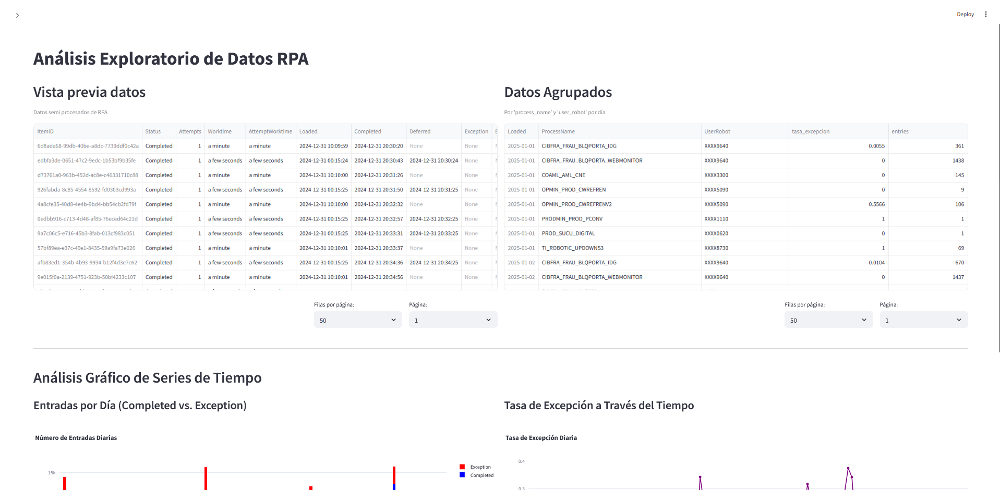
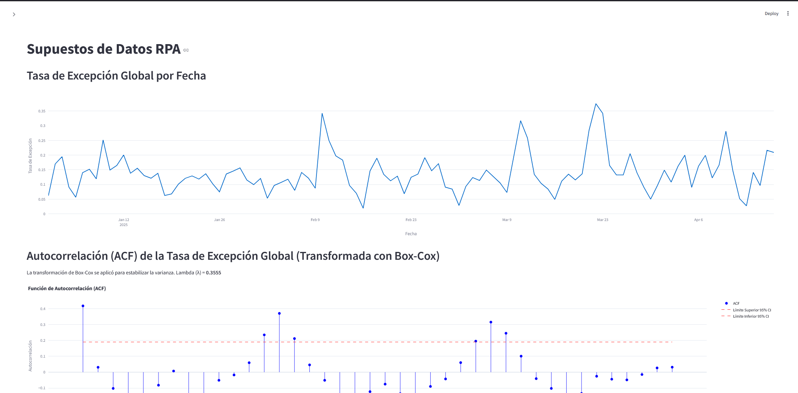

# 🤖 Sistema de Predicción de Fallas RPA

Este proyecto desarrolla un sistema inteligente para el análisis y predicción de fallas en procesos de Automatización Robótica de Procesos (RPA) utilizando técnicas avanzadas de análisis de series de tiempo y modelamiento estadístico.

## 📋 Descripción del Proyecto

**Desarrollado para el área de Robotics del Banco Itaú**

El sistema permite analizar patrones históricos de fallas en robots RPA y generar predicciones futuras para optimizar la disponibilidad y eficiencia operacional de los procesos automatizados.

## 👥 Equipo de Desarrollo

- **Bruno Cerda**
- **Santiago Valenzuela**

*Agradecemos especialmente la colaboración de Eduardo Cancino y Jonathan García por su invaluable apoyo en este proyecto.*

## 🏗️ Estructura del Proyecto

```
Prediccion_de_fallas/
├── requirements.txt              # Dependencias del proyecto
├── clean_data/                   # Datos procesados
│   ├── avg_global.parquet       # Métricas globales agregadas
│   ├── process_robot.parquet    # Datos agrupados por proceso y robot
│   └── semi_raw.parquet         # Datos semi-procesados
├── data/                        # Datos originales
│   └── WorkQueueLog_2025.csv    # Logs de trabajo de RPA
├── notebooks/                   # Notebooks de análisis
│   ├── ETS.ipynb               # Modelo ETS (Error, Trend, Seasonality)
│   └── limpieza.ipynb          # Limpieza y procesamiento de datos
└── streamlit/                   # Aplicación web interactiva
    ├── Inicio.py               # Página principal
    ├── pages/                  # Páginas de la aplicación
    │   ├── 1 Analisis_exploratorio.py
    │   ├── 2 Supuestos.py
    │   ├── 3 Modelamiento.py
    │   └── 4 Prediccion.py
    └── utils/                  # Utilidades y funciones auxiliares
        ├── data_loader.py      # Carga de datos
        └── modeling_utils.py   # Utilidades de modelamiento
```

## 🚀 Instalación y Configuración

### Prerrequisitos
- Python 3.8 o superior
- pip (gestor de paquetes de Python)

### Pasos de Instalación

1. **Clonar el repositorio**
   ```bash
   git clone <url-del-repositorio>
   cd Prediccion_de_fallas
   ```

2. **Crear un entorno virtual (recomendado)**
   ```bash
   python -m venv venv
   # En Windows:
   venv\Scripts\activate
   # En macOS/Linux:
   source venv/bin/activate
   ```

3. **Instalar dependencias**
   ```bash
   pip install -r requirements.txt
   ```

## 🖥️ Ejecutar la Aplicación

### Método 1: Streamlit (Recomendado)
```bash
cd streamlit
streamlit run Inicio.py
```

La aplicación se abrirá automáticamente en tu navegador web en `http://localhost:8501`

### Método 2: Notebooks Jupyter
```bash
jupyter notebook
```

Navega a la carpeta `notebooks/` para acceder a los análisis detallados.

## 📊 Funcionalidades de la Aplicación

### 🔍 **1. Análisis Exploratorio**
- Visualización interactiva de datos RPA
- Análisis de tendencias y patrones temporales
- Estadísticas descriptivas de las tasas de excepción
- Comparación entre diferentes robots y procesos
- Identificación de anomalías y comportamientos atípicos



### ✅ **2. Supuestos de Datos**
- Verificación de estacionariedad de las series
- Análisis de descomposición temporal (tendencia, estacionalidad)
- Transformaciones de estabilización (Box-Cox)
- Tests estadísticos de validación
- Análisis de autocorrelación y periodicidad



### 📈 **3. Modelamiento**
- Implementación de modelos ETS (Error, Trend, Seasonality)
- Entrenamiento con validación temporal
- Evaluación de métricas de rendimiento (MAE, MSE, R²)
- Análisis de residuos para validación del modelo
- Diagnóstico de la calidad del ajuste


### 🔮 **4. Predicción**
- Pronósticos futuros de tasas de excepción
- Intervalos de confianza para las predicciones
- Visualización interactiva de resultados
- Configuración de horizontes de predicción personalizados


## 📁 Datos Utilizados 

El sistema analiza datos de logs de trabajo de robots RPA que incluyen:

- **Tasas de excepción por robot y proceso**: Métricas de fallos específicas
- **Métricas globales agregadas**: Datos consolidados por período temporal
- **Información de rendimiento histórico**: Tendencias y patrones temporales
- **Patrones de comportamiento temporal**: Estacionalidad y ciclos

### Estructura de Datos Principales:

#### `semi_raw.parquet`
- **Status**: Estado del proceso (Completed, Exception, etc.)
- **Worktime**: Tiempo de trabajo del proceso
- **ProcessName**: Nombre del proceso automatizado
- **UserRobot**: Robot que ejecutó el proceso
- **Fecha de ejecución**: Timestamp del proceso

#### `avg_global.parquet`
- **entries**: Número total de entradas por día
- **tasa_excepcion**: Tasa de excepción agregada diaria

## 🎯 Objetivos del Sistema

El sistema predictivo permite:

- ✨ **Anticipar fallas** en procesos RPA antes de que ocurran
- 🚀 **Optimizar la disponibilidad** de los robots automatizados
- ⏰ **Reducir tiempos de inactividad** mediante predicciones tempranas
- 📈 **Mejorar la eficiencia operacional** de los procesos automatizados

## 🔧 Tecnologías Utilizadas

- **Python**: Lenguaje principal de desarrollo
- **Streamlit**: Framework para la aplicación web interactiva
- **Pandas**: Manipulación y análisis de datos
- **Plotly**: Visualizaciones interactivas
- **Statsmodels**: Modelos estadísticos y análisis de series de tiempo
- **SciPy**: Cálculos científicos y estadísticos
- **NumPy**: Operaciones numéricas

## 📝 Guía de Uso

1. **Inicio**: Navega a la aplicación principal para obtener una visión general
2. **Análisis Exploratorio**: Familiarízate con los datos y patrones
3. **Supuestos de Datos**: Valida las condiciones necesarias para el modelamiento
4. **Modelamiento**: Entrena y evalúa el modelo predictivo
5. **Predicción**: Genera pronósticos futuros y analiza resultados

## 🤝 Contribuciones

Este proyecto fue desarrollado como parte de un proyecto de grado para el área de Robotics del Banco Itaú. Las contribuciones y mejoras son bienvenidas.

## 📧 Contacto

Para consultas o colaboraciones:
- Bruno Cerda
- Santiago Valenzuela

---

*Desarrollado para el análisis y predicción de fallas en sistemas RPA - Banco Itaú*
